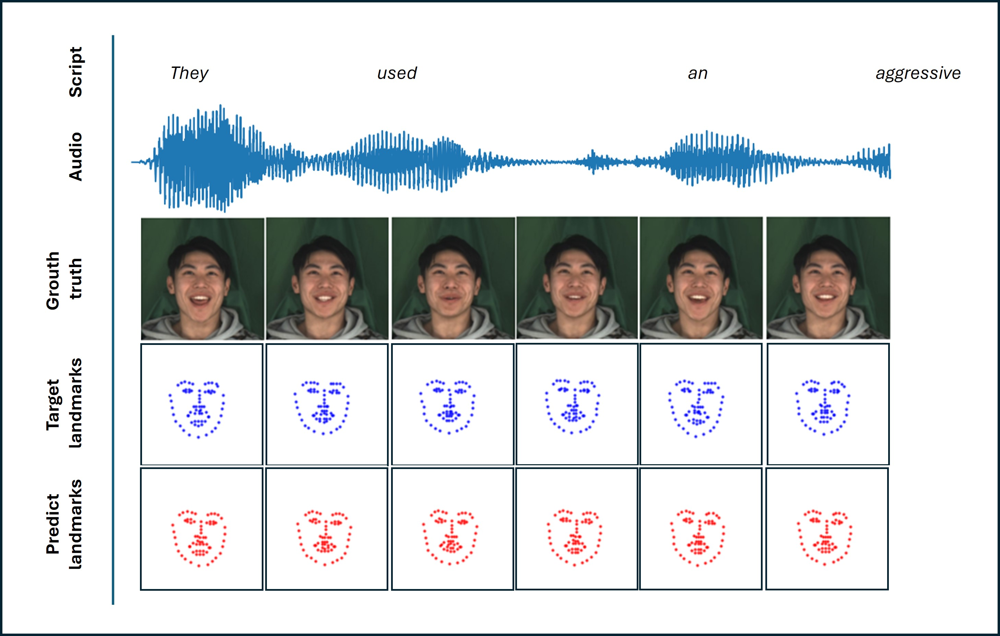

# KAN-based Fusion of Dual Domain for Audio-Driven Landmarks Generation

--------------------------------
## What is this:
KAN-based Fusion of Dual Domain for Audio-Driven Landmarks Generation of the model can help you generate an sequence of facial lanmarks from audio input.

Overview of ours model, the input is audio and one identity image, the output is a sequence of landmarks (red) compared with original landmarks (blue).


---

## How to use:
### Training
0. Clone ours repository
   ```bash
   git clone https://github.com/
   ```
1. Create the environment
    ```bash
    python3 -m venv venv
    source activate venv/bin/activate
    pip3 install -r requirements.txt
    ```
    
2. Prepair datasets:
   - Download MEAD dataset [here](https://github.com/uniBruce/Mead) or get this sample [here](https://drive.google.com/file/d/1UO2OmsBP6FqMfjDikJsXr-1QObJfzBwQ/view?usp=sharing)
   ```bash
   mkdir dataset && cd dataset
   gdown --fuzzy https://drive.google.com/file/d/1UO2OmsBP6FqMfjDikJsXr-1QObJfzBwQ/view?usp=drive_link
   unzip M030.zip
   ```
   - *(If used MEAD data you need to pre-processing by utils folder)*
  
3. Configure the experiment
   - Edit follow config/exp.json
   ```json
   {
    "datalist": "dataset/duration/fa_datalist.json", //List sample of dataset
    "audio_path": "dataset/M030/audio",
    "landmark_path": "dataset/M030/landmark",
    "video_path": "dataset/M030/video",
    "duration": 1, // Length of the video and audio
    "max_epochs": 2, // Maximum number of epochs
    "batch": 4, // Batch size

    "init_lr": 3e-4, // Initial learning rate
    "val_epochs": 4, // Number of epochs to validate
    "save_weights": "weights", // Folder to save the weights

    "is_test": true // For development
   }
   ```

4. Training
   - Run this command
    ```bash
    python3 main.py --config "config/exp.json" 
    ```

---
***Please star and follow if this repository helpful for you***

**Authorized by sowwn**
---
